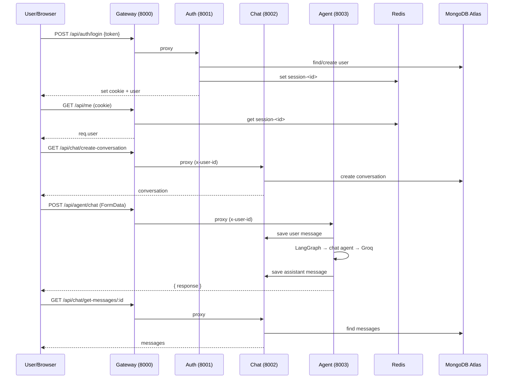

# CortexAI — End-to-End Flows

This document walks through every major flow from the browser down to the database and back.

---

## 1. Google Login (Auth Flow)

**Goal:** Let a user sign in with Google and establish a session.

### Step-by-step

1. **Frontend** — `Home.jsx` shows a login overlay because `userData` is `null`.
2. User clicks **"Continue With Google"** → `googleLogin()` in `Home.jsx` calls Firebase:
   ```js
   const result = await signInWithPopup(auth, googleProvider);
   const token = await result.user.getIdToken();
   ```
   This opens Google's popup. Firebase returns an **ID token** (JWT) proving who the user is.
3. Frontend sends the token to the backend:
   ```js
   await api.post("/api/auth/login", { token });
   ```
   `api` is the axios instance with `baseURL = VITE_SERVER_URL` and `withCredentials: true`.
4. **Gateway** receives `POST /api/auth/login` and proxies it to the **Auth service** (port 8001) — no `protect` middleware here because the user isn't logged in yet.
5. **Auth service** `login()`:
   - `getAuth(app).verifyIdToken(token)` — verifies the Firebase token, gets `decoded.uid`.
   - Looks up `User.findOne({ firebaseUid: decoded.uid })`.
   - If not found, creates a new user with `name`, `email`, `avatar` from the token.
   - Generates a `sessionId = crypto.randomUUID()`.
   - Stores the session in **Redis**: `session-<sessionId>` → `{ userId, name, email, avatar }` with a 7-day TTL.
   - Sets an **httpOnly cookie** named `session` on the response.
   - Returns the user JSON.
6. **Frontend** — `handleLogin()` dispatches `setUserdata(data)`, so `userData` is now set and the login overlay disappears.

### Result

- Browser now holds a `session` cookie.
- Redis holds `session-<id>` → user info.
- The app knows who the user is.

---

## 2. Loading the Current User (on refresh)

**Goal:** Restore the logged-in user when the page reloads.

1. `App.jsx` runs on mount → calls `getCurrentUser()`.
2. `getCurrentUser()` → `GET /api/me` (axios with credentials).
3. **Gateway** — `GET /api/me` runs `protect` middleware:
   - Reads `session` cookie.
   - Looks up `session-<id>` in Redis.
   - Attaches `req.user` and calls the local `getCurrentUser` handler.
4. Handler returns `req.user` as JSON.
5. Frontend dispatches `setUserdata(data)`.

### Result

On refresh, the user stays logged in because the cookie + Redis session are still valid.

---

## 3. Creating a Conversation (New Chat)

**Goal:** Create a new empty conversation.

1. **Frontend** — clicking **New Chat** (or the `+` icon) calls `createConversation()`.
2. `createConversation()` → `GET /api/chat/create-conversation`.
3. **Gateway** — `/api/chat` is protected: `protect` runs, then `proxyWithHeader(CHAT_SERVICE)` forwards to the **Chat service** (8002) with `x-user-id` header.
4. **Chat service** `createConversation()`:
   - Reads `req.headers["x-user-id"]`.
   - Creates a `Conversation` with `userId`.
   - Returns the new conversation.
5. **Frontend** — dispatches `addConversation(conv)` and `setSelectedConversation(conv)`.

### Result

A new conversation appears in the sidebar and becomes selected.

---

## 4. Sending a Message (Chat Flow) — the core flow

**Goal:** User types a message, gets an AI response, and both are saved.

### Step-by-step

1. **Frontend** — `ChatInput.jsx` `handleSendMessage()`:
   - Sets `isLoading = true`.
   - If no conversation is selected, creates one first (flow #3).
   - Builds a `FormData` with `prompt`, `conversationId`, `agent`, and optional `file`.
   - Dispatches `addMessage({ role: "user", content })` → user message appears immediately.
   - Calls `sendMessage(formData)` → `POST /api/agent/chat`.

2. **Gateway** — `/api/agent` is protected: `protect` runs, then `proxyWithHeader(AGENT_SERVICE)` forwards to the **Agent service** (8003) with `x-user-id`.

3. **Agent service** — `agent.controller.js`:
   - Parses the multipart body via **multer** (`upload.single("file")`).
   - Reads `prompt`, `conversationId`, `agent`, `file`.
   - Saves the **user message** to the chat service:
     ```js
     await axios.post(`${CHAT_SERVICE}/save-message`, {
       conversationId,
       role: "user",
       content: prompt,
     });
     ```
   - Runs the **LangGraph**:
     ```js
     const result = await graph.invoke({ prompt, conversationId, agent, file });
     const response = result.aiResponse;
     ```
   - Saves the **assistant message** to the chat service.
   - Returns `{ response }`.

4. **LangGraph** (`graph.js`):
   - Starts at `router` node.
   - `router` decides which agent to use:
     - If `agent` is set and not `"auto"`, use it directly.
     - If a file is present, route by mimetype (pdf → `pdf`, image → `vision`).
     - Otherwise, call the LLM to classify the prompt into `chat/search/coding/pdf/ppt/vision`.
   - Conditional edges send to the chosen agent node.
   - **Chat agent** (`chat.agent.js`) calls `getModel("chat")` (Groq) with the prompt and returns `aiResponse`.

5. **Frontend** — after `sendMessage` resolves:
   - Sets `isLoading = false`.
   - Dispatches `setArtifacts(data.artifacts || [])`.
   - Dispatches `addMessage({ role: "assistant", content: data.response })`.
   - The assistant message renders in `MessageList` → `MessageBubble`.

### Result

Both the user message and the AI response are saved in MongoDB (`chat.messages`) and displayed in the UI.

---

## 5. Loading Messages for a Conversation

**Goal:** Show the message history when a conversation is selected.

1. `ChatArea.jsx` runs a `useEffect` on `selectedConversation?._id`.
2. If the title is `"New Chat"`, it skips (nothing to load).
3. Otherwise calls `getMessages(conversationId)` → `GET /api/chat/get-messages/:id`.
4. **Gateway** → `protect` → proxy to **Chat service**.
5. **Chat service** `getMessages()` finds all messages for that `conversationId`, sorted by `createdAt` ascending.
6. Frontend dispatches `setMessages(data)` and `setArtifacts(...)`.

### Result

The conversation history appears in the chat area.

---

## 6. Logout

1. **Frontend** — `SideBar` logout button calls `logOut()` and dispatches `setUserdata(null)`.
2. `logOut()` → `GET /api/auth/logout`.
3. **Gateway** → proxies to **Auth service**.
4. **Auth service** `logOut()`:
   - Reads `session` cookie.
   - Deletes `session-<id>` from Redis.
   - Clears the cookie.
5. Frontend clears `userData` → login overlay returns.

---

## Summary diagram


